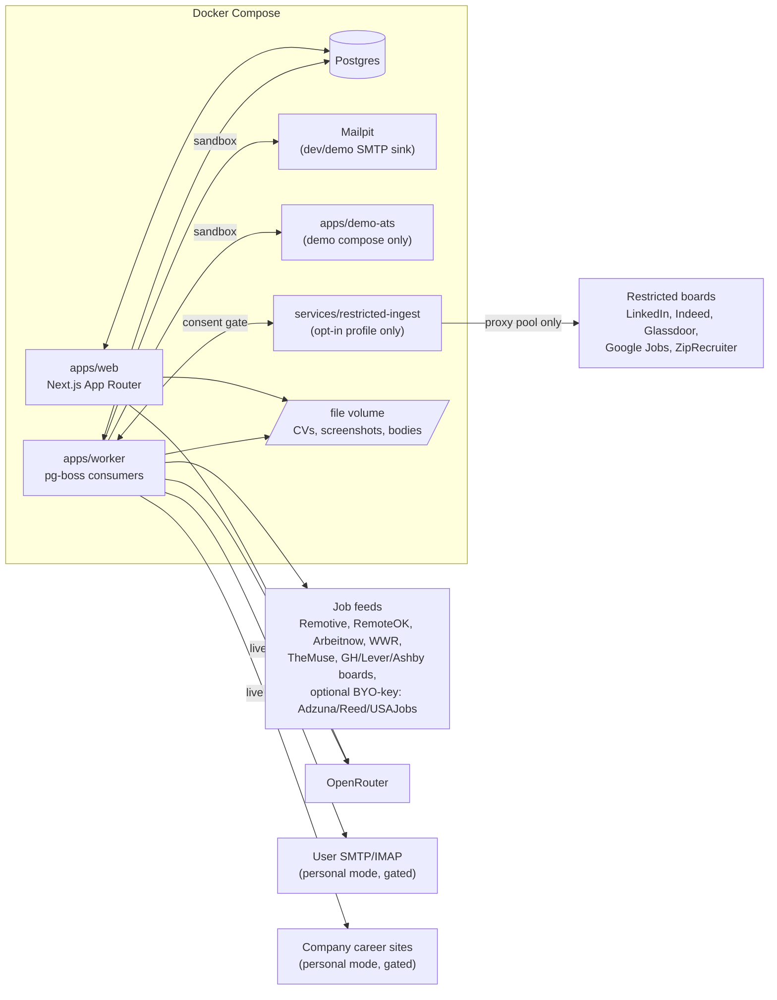

# Career HQ

An AI-assisted, self-hosted job-search workflow platform. It helps a single owner discover suitable roles, prepare grounded application materials from a personal fact bank, submit them through supported channels under an explicit multi-layer safety protocol, and track outcomes on a Kanban-style tracker with a full event history.

This is a portfolio project built to demonstrate full-stack product engineering end to end: a typed monorepo with enforced architectural boundaries, a Postgres-backed domain model with real state machines and database-level invariants, a deliberately conservative design for anything that mutates the outside world, and a CI pipeline that keeps all of it honest on every push. It is not a SaaS — it is a single-tenant app you run yourself, seeded with a fictional persona ("Alex Demo") so the tracker, fact bank, and event log are populated the moment it boots.

## Current status

**P1 (Foundation, tracker, Fact Bank), P2 (discovery ingestion and scoring), and P3 (grounded AI materials generation) are complete.** Shipped so far:

- Monorepo scaffold (pnpm workspaces + Turborepo), strict TypeScript, ESLint.
- Compose stack (`postgres`, `mailpit`, `web`, `worker`) with a parameterized Postgres host port.
- `packages/contracts` (shared Zod schemas/enums), `packages/core` (pure application + attempt state machines with guards, plus the deterministic keyword scorer), `packages/config` (validated env, submission gates default **off**), `packages/db` (Drizzle schema, migrations, repositories).
- Tracker UI: Kanban board with guarded state transitions (illegal moves show the guard's reason in the UI), application detail page with a genuine append-only event timeline, and an overview panel that surfaces the one computed next action and any overdue follow-ups.
- Candidate Fact Bank: CRUD across categories with sensitivity levels, verification/review dates, and stale-fact flagging.
- CV variant upload (designed + ATS-safe formats) with SHA-256 hashes on the file volume.
- Idempotent "Alex Demo" seed (`pnpm seed`) — ~15 facts, 2 CV variants, ~10 applications spread across states with real event history.
- **Job discovery ingestion** (`packages/ingest`): keyless-public fetchers for Remotive, RemoteOK, Arbeitnow, We Work Remotely, and The Muse, plus a Greenhouse/Lever/Ashby public-board fetcher over a user-maintained watchlist. `(source, external_id)` + content-hash dedup, 21-day expiry detection. No scraping, no credentials — see [ADR-0006](docs/adr/0006-scraping-and-tos-boundaries.md).
- **Scheduled pipeline** (`apps/worker`): a pg-boss `discovery.ingest` queue on a configurable cron (`INGEST_CRON`, default every 6 hours) runs every fetcher, marks expired jobs, and scores the inbox; a `discovery.rerank` queue follows behind it. Every run is recorded (`ingest_runs`) and visible in the `/jobs` pipeline-health panel.
- **Deterministic keyword scoring** (`packages/core`), always on: a per-workspace profile of role/stack/boost/exclude terms and a remote requirement produces a score with a persisted per-term breakdown, editable from `/settings`.
- **Optional LLM re-rank** (`packages/ai`): an OpenRouter `chatJson` client (JSON mode, tolerant extraction, Zod validation, never throws) with sequential model fallback and per-model 429 cooldown — see [ADR-0003](docs/adr/0003-openrouter-sequential-fallback.md). Re-ranks the top N keyword-scored jobs with a rationale and red flags, and never deletes or hides anything. With no `OPENROUTER_API_KEY`, the keyword order stands as-is and re-rank reports `skipped_no_key` — the whole feature works with zero AI configuration.
- **`/jobs` discovery inbox**: ranked listings with score breakdown chips and LLM rationale where available, promote-to-application (links the discovery job onto the P1 tracker board), dismiss, collapsed duplicates, and the pipeline-health panel.
- **`/settings`**: scoring-profile editor (roles/stack/boost/exclude/remote-only) and the ATS watchlist (add/remove companies the board fetcher polls next run).
- **Grounded material generation** (`packages/core`'s grounding module, `packages/ai`'s `generate` task): `selectFactsForGeneration` hard-excludes sensitive and stale facts before anything is scored, caps the model's context to a small relevant subset, and `validateGeneration` deterministically re-checks the model's own citations against the facts it was actually given — never trusting the model's self-reported `factIds`/`confidence`. A result that fails validation, or has no facts to ground in, returns `NEEDS_FACTS` with reasons and persists nothing. See [ADR-0004](docs/adr/0004-grounding-contract-and-sensitive-answers.md).
- **Sensitive-question policy**: a conservative, word-boundary keyword ruleset (`classifyQuestionSensitivity`) covering work authorization, disability, demographics, criminal history, compensation, availability, and relocation, with a fast-tier LLM tie-break that can only *widen* the block, never narrow it. A sensitive question is hard-blocked before the writing model is ever called; the only route to an answer is the manual form.
- **Cover letters, email bodies, and application-question answers** (`/applications/[id]`'s Materials and Q&A panels): streamed token-by-token via `/api/generate/stream` with a non-streaming fallback, provenance chips resolving each cited fact id back to its claim text, and an "AI-generated — not yet approved" badge until a draft is explicitly approved or rejected. With no `OPENROUTER_API_KEY`, every panel still works as a manual-draft editor, and the pure keyword ruleset still warns on a sensitive question with zero AI configured.
- **`/answers`**: a workspace-wide bank of approved, reusable answers with their source-fact count and approval date, flagged `STALE` once past their `reviewBy` date.
- **AI record/replay layer** (`AI_MODE=record|replay`, `packages/ai/src/replay`): every AI call site can record a live response to a committed fixture keyed by a hash of its exact prompt, or replay that fixture with zero network calls — used to keep CI and demos deterministic without a live key.
- CI (GitHub Actions): lint, typecheck, dependency-cruiser import-boundary checks, and the test suite against a real Postgres service container.

Everything past this point — the live email channel, assisted auto-apply, the hosted demo, and the restricted-source connector — is **planned**, not built. See [`docs/roadmap.md`](docs/roadmap.md) for the full phase-by-phase plan (P4–P7) and [`career-hq-product-spec.md`](career-hq-product-spec.md) for the normative product spec.

## Quickstart

Standard path, from a clean clone and a fresh Postgres volume:

```bash
git clone <repo-url> && cd careerHQ-app
docker compose -f infra/docker-compose.yml up -d postgres mailpit
cp .env.example .env
pnpm install
pnpm build                        # apps consume the workspace packages from dist/
pnpm --filter @careerhq/db db:migrate
pnpm seed
pnpm --filter @careerhq/web dev   # http://localhost:3000
```

Mailpit's web UI is at `http://localhost:8025` (dev/demo SMTP sink — nothing is wired to send through it yet in P1).

`apps/worker` (P2 onward) needs `pnpm --filter @careerhq/worker dev` (or the Compose `worker` service) running for scheduled discovery ingestion; without it, `/jobs` stays empty until you trigger ingestion some other way (e.g. the smoke-test pattern in `apps/worker/src/jobs/ingest.test.ts`, calling `runIngestOnce` directly).

**Discovery/AI env vars (all optional — every default keeps the deterministic floor working):**

- `OPENROUTER_API_KEY` — unset by default. Without it, the keyword-score order stands as-is and the worker's re-rank pass reports `skipped_no_key`; nothing in discovery requires it to function, and materials/Q&A generation falls back to the manual-draft path with no error.
- `AI_FAST_MODELS` — comma-separated OpenRouter model ids tried in order for re-rank and the sensitive-question tie-break, e.g. `google/gemini-2.0-flash-exp:free,meta-llama/llama-3.3-70b-instruct:free`. Defaults to two free-tier models; see [ADR-0003](docs/adr/0003-openrouter-sequential-fallback.md) for why fallback is sequential rather than raced.
- `AI_WRITING_MODELS` — comma-separated OpenRouter model ids tried in order for the writing tier (cover letters, email bodies, question answers). Defaults to `deepseek/deepseek-chat:free,meta-llama/llama-3.3-70b-instruct:free,google/gemini-2.0-flash-001`; see [ADR-0004](docs/adr/0004-grounding-contract-and-sensitive-answers.md) for the grounding contract these calls are validated against.
- `AI_MODE` — `live` (default), `record`, or `replay`. `record` persists a real response to a fixture keyed by prompt hash; `replay` returns the fixture with no network call at all — see ADR-0004.
- `AI_REPLAY_DIR` — where recorded AI fixtures live. Defaults to `packages/ai/fixtures/replay`; relative paths resolve against the repo root, same rule as `FILE_STORAGE_DIR`.
- `INGEST_CRON` — cron expression for the worker's `discovery.ingest` schedule. Defaults to `0 */6 * * *` (every 6 hours).

**One `.env`, at the repo root.** Nothing in this repo auto-loads it: `drizzle-kit`, the seed (`tsx`), `next dev` (which would only look inside `apps/web`), and the worker each load `<repo root>/.env` explicitly at startup. Variables already exported in your shell win over the file, which is Node's own `--env-file` rule. Copying `.env.example` is therefore enough — no `export DATABASE_URL=…` needed. In Docker, no `.env` exists and Compose supplies the environment instead.

`FILE_STORAGE_DIR` (CV variants and, later, screenshots and message bodies) defaults to `var/files`. Relative values resolve against the repo root, not the current process's working directory, so the seed (which runs from `packages/db`) and the web upload action (which runs from `apps/web`) write to the same tree. Compose sets it to the absolute `/app/var/files`, the path of the shared `files` volume.

**Whole stack in containers.** `docker compose -f infra/docker-compose.yml up -d --build` builds the `web` and `worker` images and runs them against the same Postgres. The images build the whole workspace (the pnpm lockfile has an importer per package, so a partial copy cannot satisfy `--frozen-lockfile`) and carry no `.env` — Compose supplies `DATABASE_URL` and `FILE_STORAGE_DIR`. Migrations and the seed are still run from the host, as above.

**Port already in use?** If `5432` is taken on your host, set `CAREERHQ_PG_PORT` (e.g. `CAREERHQ_PG_PORT=5433`) before `docker compose up`, and update `DATABASE_URL` in `.env` to match. The compose file reads this variable to remap the Postgres host port; the container's internal port and `web`/`worker`'s in-network `DATABASE_URL` are unaffected.

**Upgrading a pre-P2 database.** Migration `0001` adds `UNIQUE(workspace_id, name)` on `companies` — P1 allowed duplicates, so a database seeded before P2 may fail the migration on existing rows. Check and dedupe first:

```sql
select workspace_id, name, count(*) from companies group by 1, 2 having count(*) > 1;
```

For each group, repoint `jobs.company_id` at the row you keep and delete the rest, then run `db:migrate`.

**Resetting the database.** `drizzle-kit migrate` does not drop existing objects. To fully reset (e.g. after a schema change that doesn't cleanly migrate), connect with `psql` and run:

```sql
drop schema public cascade;
drop schema if exists drizzle cascade;
create schema public;
```

then re-run `db:migrate` and `pnpm seed`. The second `drop schema` is necessary because `drizzle-kit` tracks applied migrations in its own `drizzle` schema, not just `public` — dropping only `public` leaves migration history that no longer matches reality.

## Architecture

Full detail, including the data model ERD, the gated-submission sequence diagram, and the monorepo layout, lives in [`docs/architecture.md`](docs/architecture.md). System overview (§1):



As of P3, the live parts of this diagram are `web`, `worker`, `postgres`, `mailpit`, the file volume, the keyless job **feeds** (Remotive, RemoteOK, Arbeitnow, WWR, The Muse, and watchlisted Greenhouse/Lever/Ashby boards), and, if `OPENROUTER_API_KEY` is set, **OpenRouter** from both `web` (grounded materials/Q&A generation) and `worker` (re-rank) — everything else (live SMTP/IMAP, live company-site submission, the restricted connector) is architected for but not yet wired up.

## Documentation

- [`career-hq-product-spec.md`](career-hq-product-spec.md) — the normative product specification (v0.3).
- [`docs/architecture.md`](docs/architecture.md) — system diagram, data model, monorepo layout, gated-submission sequence.
- [`docs/roadmap.md`](docs/roadmap.md) — phase-by-phase delivery plan, P1–P3 (done) through P7.
- [`docs/adr/0001-postgres-and-pg-boss.md`](docs/adr/0001-postgres-and-pg-boss.md) — why Postgres + pg-boss over SQLite/Redis.
- [`docs/adr/0002-gated-mutation-protocol.md`](docs/adr/0002-gated-mutation-protocol.md) — the three-layer gated-mutation design (state machine shipped in P1, enforcement lands in P4).
- [`docs/adr/0003-openrouter-sequential-fallback.md`](docs/adr/0003-openrouter-sequential-fallback.md) — the ported `chat-json` pattern and why fallback is sequential, not raced.
- [`docs/adr/0004-grounding-contract-and-sensitive-answers.md`](docs/adr/0004-grounding-contract-and-sensitive-answers.md) — the grounding contract (deterministic citation post-validation, `NEEDS_FACTS`) and the conservative, widen-only sensitive-question policy.
- [`docs/adr/0006-scraping-and-tos-boundaries.md`](docs/adr/0006-scraping-and-tos-boundaries.md) — the keyless-only core boundary and the isolated, opt-in restricted-source connector.

## Screenshots

Screenshots and a short demo video land with the P6 hosted-demo polish phase, once there is a public instance to record against.

## License

MIT. The `LICENSE` file itself is added at public release (P6), alongside the rest of the docs/portfolio polish — see [`docs/roadmap.md`](docs/roadmap.md#p6--hosted-demo-and-portfolio-polish).
