# Career HQ

**Live demo: <https://careerhq.nickkalas.dev>** — no signup, a fictional persona, a live feed of real job listings, resets every six hours. What you can and cannot do there is spelled out in [Live demo](#live-demo).
**Source: <https://github.com/Olorin4/careerhq>** · [`SECURITY.md`](SECURITY.md) · [MIT licensed](LICENSE)

An AI-assisted, self-hosted job-search workflow platform. It helps a single owner discover suitable roles, prepare grounded application materials from a personal fact bank, submit them through supported channels under an explicit multi-layer safety protocol, and track outcomes on a Kanban-style tracker with a full event history.

This is a portfolio project built to demonstrate full-stack product engineering end to end: a typed monorepo with enforced architectural boundaries, a Postgres-backed domain model with real state machines and database-level invariants, a deliberately conservative design for anything that mutates the outside world, and a CI pipeline that keeps all of it honest on every push. It is not a SaaS — it is a single-tenant app you run yourself, seeded with a fictional persona ("Alex Demo") so the tracker, fact bank, and event log are populated the moment it boots.

## Current status

**P1 (Foundation, tracker, Fact Bank), P2 (discovery ingestion and scoring), P3 (grounded AI materials generation), P4 (the email channel), P5 (assisted auto-apply), and P6 (hosted demo and portfolio polish) are complete.** Only P7, the optional restricted-source connector, remains. Shipped so far:

- Monorepo scaffold (pnpm workspaces + Turborepo), strict TypeScript, ESLint.
- Compose stack (`postgres`, `mailpit`, `web`, `worker`) with a parameterized Postgres host port.
- `packages/contracts` (shared Zod schemas/enums), `packages/core` (pure application + attempt state machines with guards, plus the deterministic keyword scorer), `packages/config` (validated env, submission gates default **off**), `packages/db` (Drizzle schema, migrations, repositories).
- Tracker UI: Kanban board with guarded state transitions (illegal moves show the guard's reason in the UI), application detail page with a genuine append-only event timeline, and an overview panel that surfaces the one computed next action and any overdue follow-ups.
- Candidate Fact Bank: CRUD across categories with sensitivity levels, verification/review dates, and stale-fact flagging.
- CV variant upload (designed + ATS-safe formats) with SHA-256 hashes on the file volume.
- Idempotent "Alex Demo" seed (`pnpm seed`) — ~15 facts, 2 CV variants, ~10 applications spread across states with real event history.
- **Job discovery ingestion** (`packages/ingest`): keyless-public fetchers for Remotive, RemoteOK, Arbeitnow, We Work Remotely, and The Muse, plus a Greenhouse/Lever/Ashby public-board fetcher over a user-maintained watchlist. `(source, external_id)` + content-hash dedup, 21-day expiry detection. No scraping, no credentials — see [ADR-0006](docs/adr/0006-scraping-and-tos-boundaries.md).
- **Scheduled pipeline** (`apps/worker`): a pg-boss `discovery.ingest` queue on a configurable cron (`INGEST_CRON`, default every 6 hours) runs every fetcher, marks expired jobs, and scores the inbox; a `discovery.rerank` queue follows behind it. Every run is recorded (`ingest_runs`) and visible in the `/jobs` pipeline-health panel.
- **Deterministic keyword scoring** (`packages/core`), always on: a per-workspace profile of role/stack/boost/exclude terms and a remote requirement produces a score with a persisted per-term breakdown, editable from `/settings`.
- **Optional LLM re-rank** (`packages/ai`): an OpenRouter `chatJson` client (JSON mode, tolerant extraction, Zod validation, never throws) with sequential model fallback and per-model 429 cooldown — see [ADR-0003](docs/adr/0003-openrouter-sequential-fallback.md). Re-ranks the top N keyword-scored jobs with a rationale and red flags, and never deletes or hides anything. With no `OPENROUTER_API_KEY`, the keyword order stands as-is and re-rank reports `skipped_no_key` — the whole feature works with zero AI configuration.
- **`/jobs` discovery inbox**: ranked listings with score breakdown chips and LLM rationale where available, promote-to-application (links the discovery job onto the P1 tracker board), dismiss, collapsed duplicates, and the pipeline-health panel.
- **`/settings`**: scoring-profile editor (roles/stack/boost/exclude/remote-only) and the ATS watchlist (add/remove companies the board fetcher polls next run).
- **Grounded material generation** (`packages/core`'s grounding module, `packages/ai`'s `generate` task): `selectFactsForGeneration` hard-excludes sensitive and stale facts before anything is scored, caps the model's context to a small relevant subset, and `validateGeneration` deterministically re-checks the model's own citations against the facts it was actually given — never trusting the model's self-reported `factIds`/`confidence`. A result that fails validation, or has no facts to ground in, returns `NEEDS_FACTS` with reasons and persists nothing. See [ADR-0004](docs/adr/0004-grounding-contract-and-sensitive-answers.md).
- **Sensitive-question policy**: a conservative, word-boundary keyword ruleset (`classifyQuestionSensitivity`) covering work authorization, disability, demographics, criminal history, compensation, availability, and relocation, with a fast-tier LLM tie-break that can only *widen* the block, never narrow it. A sensitive question is hard-blocked before the writing model is ever called; the only route to an answer is the manual form.
- **Cover letters, email bodies, and application-question answers** (`/applications/[id]`'s Materials and Q&A panels): streamed token-by-token via `/api/generate/stream` with a non-streaming fallback, provenance chips resolving each cited fact id back to its claim text, and an "AI-generated — not yet approved" badge until a draft is explicitly approved or rejected. With no `OPENROUTER_API_KEY`, every panel still works as a manual-draft editor, and the pure keyword ruleset still warns on a sensitive question with zero AI configured.
- **`/answers`**: a workspace-wide bank of approved, reusable answers with their source-fact count and approval date, flagged `STALE` once past their `reviewBy` date.
- **AI record/replay layer** (`AI_MODE=record|replay`, `packages/ai/src/replay`): every AI call site can record a live response to a committed fixture keyed by a hash of its exact prompt, or replay that fixture with zero network calls — used to keep CI and demos deterministic without a live key.
- **Encrypted mailbox credentials** (`packages/db/src/crypto.ts`): SMTP/IMAP passwords are sealed with libsodium `crypto_secretbox` under an env-supplied `CAREERHQ_MASTER_KEY`; the `credentials` table stores ciphertext only, every adapter/settings error is redacted before it is stored or rendered, and disconnecting a mailbox deletes its credential rows in the same transaction. See [ADR-0005](docs/adr/0005-credential-encryption.md).
- **First live external mutation, gated three ways** (spec §11): the `SUBMISSIONS_LIVE_EMAIL` env flag must be on; a sandbox workspace may only send to `SANDBOX_SMTP_ALLOWED_HOST`; and every send needs a fresh preview → payload-fingerprint pin → single-use confirmation token → retyped-recipient match, evaluated in one order-dependent matrix (`evaluateSubmissionGates`, `packages/core/src/gates`) that denies `duplicate_submission`, `attempt_in_flight`, `gate_closed`, `sandbox_blocked`, or a token/fingerprint/target mismatch before anything is sent.
- **Receipts around the send, not just after it**: a pending receipt (recipient, subject, attachment hashes) is written *before* the SMTP call, a confirmed receipt carries the real Message-ID once accepted, and an unclassifiable outcome (a stubbed DATA-phase failure, an ambiguous SMTP response) parks the attempt as `NEEDS_RECONCILE` — resolvable only by an explicit human action (`resolveReconcileAction`, `/applications/[id]`), never auto-retried.
- **`/settings/email`**: connect a mailbox (SMTP + optional IMAP), a pre-save connection test, redacted health status on failure, and disconnect (hard-deletes the connection and its credentials). Shows an explanatory "set `CAREERHQ_MASTER_KEY`" state, with the generator command, when no key is configured.
- **Email panel on `/applications/[id]`**: draft → preview → retype-target confirm → send, full attempt history, and the `NEEDS_RECONCILE` reconcile action inline.
- **`/inbox`**: the classification/threading review queue — every inbound reply with its suggested classification, confidence, quoted evidence, and a one-click accept/reject onto the application's timeline.
- **IMAP sync worker** (`apps/worker`'s `email-sync` job on `EMAIL_SYNC_CRON`, default every 15 minutes): polls every connected mailbox, threads replies onto an application by `In-Reply-To`/`References` headers first and sender-domain only when unambiguous, and enforces each connection's retention mode (`metadata_only` stores no body, `full_local` keeps it, `days_limited` keeps it until `purgeExpiredBodies` sweeps it). With no `CAREERHQ_MASTER_KEY` the sync is a no-op, not a failure.
- **`classifyReply` + auto-acknowledge** (`packages/ai`): classifies a threaded reply (ack/rejection/other) with a confidence and quoted evidence; a classification at or above `AUTO_ACK_CONFIDENCE` (0.9) on a `SUBMITTED` application drives the tracker's own `classification` trigger straight to `ACKNOWLEDGED` — everything below that bar, or any other state, waits in `/inbox` for a human decision.
- **Safe local demo recipe**: set `SUBMISSIONS_LIVE_EMAIL=true` and connect a mailbox pointed at Mailpit (`localhost:1025` for a host-run `pnpm dev`; the `mailpit` service name inside Compose) — safety here comes from the connection itself pointing at Mailpit, so the worst a demo can do is land a message in Mailpit's own web UI (`http://localhost:8025`), never a real inbox. (The `SANDBOX_SMTP_ALLOWED_HOST` allow-list is a separate gate that only applies to `sandbox`-kind workspaces — the local workspace here is `personal`, so that gate never fires; it protects the hosted demo's sandbox workspace instead, P6.)
- **Assisted auto-apply** (`packages/autoapply`, `apps/worker`'s Playwright driver, `apps/web`'s site-submission orchestrator): reads a live employer career-site page in an isolated browser context and turns it into a browser-free `RawFormPage` → `CanonicalForm` — DOM selectors are never the data model, spec §10.3 — so ATS detection, blocker detection, and field mapping are pure, fixture-tested functions. See [ADR-0007](docs/adr/0007-canonical-form-schema.md).
- **Greenhouse and Lever adapters, generic fallback**: name/id pattern hints layered over an ATS-agnostic structural parser, each with a committed saved-HTML regression fixture (`packages/autoapply/fixtures`) and a sha256 hash tripwire that fails first if `demo-ats`'s markup drifts without the fixture being regenerated. Every parsed form carries `parserVersion` for traceability. An unrecognized site falls back to the generic parser at lowered confidence for closer review.
- **Deterministic answer planning, then a bounded AI pass** (`packages/core`'s `planAnswers`/`requiresUserBeforeSubmit`): identity/contact fields fill from the fact bank, screening questions reuse an exact saved answer, the CV attaches from the application's chosen variant — and **sensitive fields (work authorization, visa sponsorship, desired salary, demographics, criminal history, legal attestation, notice period, availability, relocation) are never AI-filled**, structurally: `planAnswers` has no code path that can emit `source: "ai"` for them, and `requiresUserBeforeSubmit` re-checks the invariant independently as a belt-and-braces guard. Only unresolved free-text screening questions get an AI-drafted answer, under the same grounding/validation contract as email and materials generation (ADR-0004) — visibly marked, never silently filled.
- **Review screen with per-answer provenance** (`/applications/[id]`'s site panel): every field shows its source (fact/saved answer/document/user/AI), a confidence percentage, a "Needs your answer" flag, a "Differs from approved" flag when it disagrees with a previously approved answer, and a skip-optional action for any non-required field. The attached CV is named explicitly with a change link. Preview is impossible while `requiresUserBeforeSubmit` reports anything still needing the user.
- **A required attestation checkbox is field-level consent, not a blocker**: the review screen renders it as an explicit, never-pre-ticked checkbox next to the exact attestation wording, and only the user's own click sets it — CareerHQ never ticks it on their behalf (spec §10.6, revised); once ticked it carries `source: "user"` into the fingerprinted payload and the confirmed receipt, and it is never satisfied by a saved answer from another application (`CONSENT_ONLY_FIELDS`, `packages/core`). What still cannot be honestly rendered as a tick — a typed signature, a signature-date field — still pauses the attempt.
- **Blockers pause and return control, never bypass**: CAPTCHA, login wall, identity verification, coding assessment, a non-checkbox legal attestation (typed signature/date), or an upload control that accepts neither PDF nor DOC stops the attempt as `BLOCKED` with a typed reason and human-readable guidance. This is a pause, not a failure: the attempt is visible in the application's history and nothing was submitted.
- **The same three-layer gate and receipt design as email, reused, not reinvented** (`apps/web/src/lib/site-submission.ts`): `SUBMISSIONS_LIVE_COMPANY_SITE` off by default, a sandbox workspace restricted to `SANDBOX_SITE_ALLOWED_HOST`, and a preview → payload-fingerprint pin → single-use confirmation token → retyped-host match before the one submit click. A pending receipt is written before the click; a confirmed receipt carries the confirmation id, final URL, and a saved confirmation-page screenshot; a submit that throws or returns no confirmation id becomes `NEEDS_RECONCILE`, never a false `FAILED`. Duplicate-requisition detection refuses a second prepare unless the user explicitly overrides, recorded in the event log.
- **`apps/demo-ats`**: a small fictional-company careers site (Greenhouse-style multi-step form at `/greenhouse/jobs/eng-1`, Lever-style single-page form at `/lever/jobs/eng-2`, a Lever-style typed-signature form at `/signature/jobs/:id`) and the only auto-apply destination in CI or any local demo — `eng-1` carries a required legal attestation checkbox, which the user ticks on the review screen; `eng-2` is the happy path; `/signature/jobs/:id`'s typed signature/date fields are the demo's blocked case, since those cannot be rendered as a single honest tick. No new route was added to `apps/web` for this — auto-apply lives inside the existing `/applications/[id]` detail page, alongside the email panel.
- **Demo safety as a runtime mode, not a fork** (P6): one `DEMO_MODE` env plus a `workspaces.kind = "sandbox"` row selects the demo workspace, disables credential setup **server-side** (the UI state is not the enforcement), arms a per-action rate limiter, renders the never-dismissible banner, and schedules a wipe-and-reseed of the sandbox workspace every six hours inside a single advisory-locked transaction. Nothing about the personal-mode code path changes. The reset queue is registered *only* in demo mode, and the worker `unschedule`s it when demo mode is off, so a one-off demo run cannot leave a data-deleting job firing forever.
- **The demo cannot reach anything real**: `infra/docker-compose.demo.yml` pins both live-submission gates `false` **as literals** — no env file, shell variable or `docker compose` invocation can open them — deletes `OPENROUTER_API_KEY` outright (`!reset`, so it is *absent*, not empty), runs AI in replay against committed fixtures, and publishes only `web`, only on `127.0.0.1`. Postgres, Mailpit and `demo-ats` have no published ports at all.
- **Bounded for a shared 3.7 GB VPS**: a hard `mem_limit` per service (2756 MB worst case), rotated logs, `shm_size` sized for Chromium's renderer, one headless browser per process with an honest "busy, try again" refusal that holds its slot across a whole confirm so a refusal cannot burn a confirmation token, and disk ceilings a reset gives back — 2 MB per CV and 64 MB/100 files for the demo's CV store, a shared 64 MB/200-file ceiling for auto-apply evidence screenshots reserved *before* the submit click.
- **The driver refuses to fill a field whose question changed since review**: same id, same field-identity hash (selector *and* the question beside it), same field kind, checked from both the live page's side and the reviewed side, before a single keystroke. A mismatch throws pre-click, and a pre-click refusal costs nothing: the confirmation is handed back unspent and the attempt stays confirmable, rather than being parked for a human — a browser that never clicked cannot have submitted.
- **Portfolio surface**: [`SECURITY.md`](SECURITY.md), an MIT [`LICENSE`](LICENSE), [`docs/runbook-demo.md`](docs/runbook-demo.md) with real deploy/update/reset/backup/restore/rollback commands, an automated screenshot gallery and walkthrough recording, and a quickstart verified from a clean clone.
- CI (GitHub Actions): lint, typecheck, dependency-cruiser import-boundary checks, and the test suite against a real Postgres service container, including a Mailpit round-trip e2e suite (`apps/web/src/lib/email-e2e.test.ts`) and a real-Chromium `demo-ats` round-trip e2e suite (`apps/web/src/lib/site-e2e.test.ts`, 8 cases: the full happy path, the checkbox-attestation consent-tick demotion, all five gate refusals, and both blocker kinds) that both skip cleanly with no `TEST_DATABASE_URL` or an unreachable dependency.

Everything past this point — the restricted-source connector (P7) — is **planned**, not built, and is deliberately excluded from the hosted demo. See [`docs/roadmap.md`](docs/roadmap.md) for the full phase-by-phase plan, including the work carried forward out of P6 with the reason each item was left, and [`career-hq-product-spec.md`](career-hq-product-spec.md) for the normative product spec.

## Live demo

<https://careerhq.nickkalas.dev> — no signup, nothing to install, and no personal data of anyone inside it.

The persona is the same fictional "Alex Demo" the local seed uses. Every application, fact, CV and message is invented; no real person's data has ever been in that database.

**One thing there is real, on purpose: the discovery inbox.** The demo runs the same keyless-public ingestion a self-hosted install does, so `/jobs` fills every six hours with genuine, currently-advertised listings from Remotive, RemoteOK, Arbeitnow, We Work Remotely and The Muse, scored and ranked beside the 30 seeded ones. Watching the scorer rank real postings is the point; a fixture cannot honestly stand in for it. Those are public job advertisements — no applicant or individual's data — fetched with read-only HTTP GETs under an honest `CareerHQ/0.6` user agent, and wiped by the same six-hourly reset. [`SECURITY.md`](SECURITY.md#the-hosted-demo) spells out the boundary.

**What you can do there**

- Browse and edit the whole app: the Kanban tracker with its guarded transitions, the append-only event timeline, the fact bank, the scored discovery inbox, the answer bank, the mail review queue.
- Promote a discovered job onto the tracker, then generate a grounded cover letter and watch the provenance chips resolve each cited claim back to the fact it came from — including the deliberate `NEEDS_FACTS` refusal when nothing supports the claim.
- Run auto-apply end to end against the bundled fictional ATS: capture, review every planned answer with its source and confidence, tick a legal-attestation checkbox yourself, preview, retype the target, confirm, and read the receipt.
- Watch the safety machinery refuse things: a sensitive question hard-blocked before the writing model is called, a gate denial, a rate-limit refusal, a second concurrent browser request turned away.

**What you cannot do there**

- **Configure a real mailbox.** `/settings/email` renders an explanatory panel instead of the connection form, and both server actions refuse regardless — the UI is not the enforcement.
- **Reach a real employer.** Auto-apply can only reach the bundled `demo-ats` service; email can only reach an internal Mailpit sink that accepts mail and never delivers it.
- **Spend anyone's model tokens.** No provider key is deployed at all; AI runs from committed replay fixtures — a real recorded generation per seeded application, for both the cover letter and the email body. Anything outside that recorded set (a free-text screening question, an application you add yourself) says so in a sentence rather than generating.
- **Keep your work.** The workspace is wiped and reseeded **every six hours**. Anything you type is temporary by design.
- **Reach anything but the web app.** Postgres, Mailpit and `demo-ats` publish no ports; only `web` is exposed, and only through the edge proxy.

There is no login on the demo — it is a public exhibit holding no personal data, with every mutating channel shut, so a password would be a secret to protect that protects nothing. That is a property of *the demo*, not of CareerHQ: a personal install holding real data must have authentication put in front of it. See [`SECURITY.md`](SECURITY.md).

## Quickstart

### The whole thing in containers — no toolchain needed

Docker is the only prerequisite. This runs the same stack the public demo runs, on your own machine:

```bash
git clone https://github.com/Olorin4/careerhq.git && cd careerhq
docker compose -f infra/docker-compose.yml -f infra/docker-compose.demo.yml \
  --profile tools run --rm migrate                        # create the schema, once
docker compose -f infra/docker-compose.yml -f infra/docker-compose.demo.yml \
  up -d --build                                           # http://127.0.0.1:3100
```

The first build pulls ~2.5 GB of Playwright base image (the app drives a real Chromium), so allow a few minutes. **There is no seed step**: the worker seeds the demo workspace itself at boot and again every six hours. Watch it happen with `docker compose -f infra/docker-compose.yml -f infra/docker-compose.demo.yml logs -f worker`.

Everything that would let this reach the outside world is pinned off in the overlay, so a local run is as harmless as the hosted one. Stop it with `... down`, or `... down --volumes` to throw the data away too. Operational commands — forced reset, backup, restore, rollback — are in [`docs/runbook-demo.md`](docs/runbook-demo.md).

### The development path

Node ≥ 22 and pnpm 10. From a clean clone and a fresh Postgres volume:

```bash
git clone https://github.com/Olorin4/careerhq.git && cd careerhq
docker compose -f infra/docker-compose.yml up -d postgres mailpit
cp .env.example .env
pnpm install
pnpm build                        # apps consume the workspace packages from dist/
pnpm --filter @careerhq/db db:migrate
pnpm seed
pnpm --filter @careerhq/web dev   # http://localhost:3000
```

Mailpit's web UI is at `http://localhost:8025` — the dev/demo SMTP sink that stands in for a real mail provider from P4 onward.

**Every published port binds to `127.0.0.1`.** Docker publishes to `0.0.0.0` by default and its own firewall rules sit ahead of UFW, so an unqualified publish is reachable from the internet on any box with a public IP — and Mailpit's UI is an unauthenticated view of every message the app "sent". `infra/docker-compose.yml` therefore binds Postgres, Mailpit and `demo-ats` to loopback, and `web` too unless you set `CAREERHQ_WEB_BIND=0.0.0.0` for a LAN demo. Containers reach each other by service name on the compose network, so nothing needs a published port to work.

**If a port is already taken.** Postgres publishes `${CAREERHQ_PG_PORT:-5432}`, so set `CAREERHQ_PG_PORT=5433` (and match it in `.env`'s `DATABASE_URL`) if 5432 is busy. Mailpit's `1025`/`8025` and `demo-ats`'s `3001` are fixed: if you already run something on them — including another copy of this stack — stop that first, since Compose cannot start a second publisher of the same host port.

`apps/worker` (P2 onward) needs `pnpm --filter @careerhq/worker dev` (or the Compose `worker` service) running for scheduled discovery ingestion; without it, `/jobs` stays empty until you trigger ingestion some other way (e.g. the smoke-test pattern in `apps/worker/src/jobs/ingest.test.ts`, calling `runIngestOnce` directly).

**Discovery/AI env vars (all optional — every default keeps the deterministic floor working):**

- `OPENROUTER_API_KEY` — unset by default. Without it, the keyword-score order stands as-is and the worker's re-rank pass reports `skipped_no_key`; nothing in discovery requires it to function, and materials/Q&A generation falls back to the manual-draft path with no error.
- `AI_FAST_MODELS` — comma-separated OpenRouter model ids tried in order for re-rank and the sensitive-question tie-break. Defaults to `google/gemini-2.5-flash-lite,qwen/qwen3-30b-a3b-instruct-2507,meta-llama/llama-3.3-70b-instruct`; see [ADR-0003](docs/adr/0003-openrouter-sequential-fallback.md) for why fallback is sequential rather than raced.
- `AI_WRITING_MODELS` — comma-separated OpenRouter model ids tried in order for the writing tier (cover letters, email bodies, question answers). Defaults to `deepseek/deepseek-v4-flash,qwen/qwen3-30b-a3b-instruct-2507,meta-llama/llama-3.3-70b-instruct`; see [ADR-0004](docs/adr/0004-grounding-contract-and-sensitive-answers.md) for the grounding contract these calls are validated against.
- Both default lists are cheap paid models (fractions of a cent per call) rather than free ones, and every id was verified by running this repo's own prompts against it. OpenRouter retires `:free` aliases without notice — the previous all-free defaults answered `http_404` on every call — so if AI stops working, check your ids against <https://openrouter.ai/api/v1/models> first, and verify a replacement with a real call before pinning it. The tiers are not interchangeable: some models pass re-rank/classification and still fail the stricter grounded-generation schema.
- `AI_MODE` — `live` (default), `record`, or `replay`. `record` persists a real response to a fixture keyed by prompt hash; `replay` returns the fixture with no network call at all — see ADR-0004.
- `AI_REPLAY_DIR` — where recorded AI fixtures live. Defaults to `packages/ai/fixtures/replay`; relative paths resolve against the repo root, same rule as `FILE_STORAGE_DIR`.
- `INGEST_CRON` — cron expression for the worker's `discovery.ingest` schedule. Defaults to `0 */6 * * *` (every 6 hours).

**Email channel env vars:**

- `CAREERHQ_MASTER_KEY` — base64-encoded 32-byte libsodium `crypto_secretbox` key used to seal/open stored SMTP/IMAP passwords ([ADR-0005](docs/adr/0005-credential-encryption.md)). Unset by default, which disables email connections entirely (`/settings/email` shows a "set this to enable" state rather than erroring). Generate one with `node -e "console.log(require('crypto').randomBytes(32).toString('base64'))"`.
- `SUBMISSIONS_LIVE_EMAIL` — `false` by default (the deterministic-off gate, spec §11). Must be `true` for any real send to leave `PENDING_CONFIRMATION`; with it off, preview/draft/confirm-dialog UI still works end to end, it just cannot reach the gate's final `allowed` decision.
- `SANDBOX_SMTP_ALLOWED_HOST` — the only SMTP host a `sandbox`-kind workspace may send to. Defaults to `mailpit` (the Compose service name); set to `localhost` when running a host `pnpm dev` process against the Compose Mailpit's exposed port.
- `EMAIL_SYNC_CRON` — cron expression for the worker's IMAP-poll `email-sync` job. Defaults to `*/15 * * * *` (every 15 minutes).

**Auto-apply env vars:**

- `SUBMISSIONS_LIVE_COMPANY_SITE` — `false` by default (the deterministic-off gate, spec §11, mirroring `SUBMISSIONS_LIVE_EMAIL`). Must be `true` for a confirmed submit to leave `PENDING_CONFIRMATION`; with it off, capture/parse/plan/review/preview all still work end to end, they just cannot reach the gate's final `allowed` decision.
- `SANDBOX_SITE_ALLOWED_HOST` — the only site **origin** a `sandbox`-kind workspace may auto-apply to. Compared as scheme + host + port, and accepts three spellings: `demo-ats` (host only), `demo-ats:3001`, or `http://demo-ats:3001`. Defaults to `demo-ats` (the Compose service name); use `http://localhost:3001` when running a host `pnpm dev` process against the Compose `demo-ats`'s exposed port. **Name the port.** A value with no port matches *any* port on that host — the legacy spelling, kept working because it is the shipped default — which for a sandbox on `localhost` means Postgres, Redis and the app's own port are all inside the allow-list. **If you point it at `localhost`, set `SANDBOX_FORCE_SAFE=true` too.** `localhost` is a loopback name, and the capture policy's exemption that lets the allowed target be a loopback one applies only to sandbox-effective workspaces — a personal workspace gets no exemption, on purpose, because it has no allow-list pinning it to one origin and would otherwise be able to open every port on the box.
- `DEMO_ATS_URL` — the base URL of the fictional ATS (`apps/demo-ats`), the only auto-apply destination in CI or any local demo. Defaults to `http://demo-ats:3001` (the Compose service); set to `http://localhost:3001` when running `demo-ats` directly on the host.
- `AUTOAPPLY_BROWSER_TIMEOUT_MS` — per-action budget for the Playwright driver (one navigation, one field action, the post-submit wait) — not the whole attempt. Defaults to `45000`.
- `AUTOAPPLY_MAX_CONCURRENT_BROWSERS` — how many headless Chromium instances **one process** may hold open at once. Defaults to `1`. Read by both `web` and `worker`, and enforced per process, so a Compose stack running both can have two browsers alive on the box — size RAM for `web + worker × this number`. A refused acquirer is told "busy, try again" immediately rather than queued, so nothing hangs; the slot is held across a whole confirm, so a refusal can never burn a confirmation token.

**Demo-mode env vars** (a personal, self-hosted install leaves all four alone):

- `DEMO_MODE` — `false` by default. `true` resolves the **sandbox** workspace instead of the personal one, disables mailbox credential setup server-side, arms the rate limiter, renders the never-dismissible demo banner, and registers the reset job. Read by both `web` and `worker` so the two operate on the same workspace.
- `DEMO_RESET_CRON` — how often the worker wipes and reseeds the demo workspace. Defaults to `0 */6 * * *` (every six hours). Worker-only. The `demo.reset` queue is created, scheduled and consumed **only** when `DEMO_MODE=true`, and the worker `unschedule`s it when demo mode is off — a schedule row outlives the process that created it, so a one-off demo run must not leave a data-deleting job firing forever. The worker also runs one reset at boot, because pg-boss does not fire a schedule on registration.
- `DEMO_RATE_LIMIT_PER_MIN` — per-action, per-minute call budget for the web app. Defaults to `30`, and applies **only** in demo mode; a personal install is never throttled. It is per-process and per-action, not per-visitor — see [`SECURITY.md`](SECURITY.md).
- `SANDBOX_FORCE_SAFE` — `false` by default, and **not** an alias for `DEMO_MODE`. It forces every submission through the sandbox host allow-list regardless of which workspace resolution actually returned: belt-and-braces against a workspace-resolution regression on the one deployment where strangers drive the app. Also required when you point `SANDBOX_SITE_ALLOWED_HOST` at `localhost` (see above).

The hosted demo sets all of these as **literals** in `infra/docker-compose.demo.yml`, not as `${...}` interpolations, so nothing in an env file can change them. `infra/demo.env.example` documents what remains configurable there, which is only scheduling and timeouts.

**One `.env`, at the repo root.** Nothing in this repo auto-loads it: `drizzle-kit`, the seed (`tsx`), `next dev` (which would only look inside `apps/web`), and the worker each load `<repo root>/.env` explicitly at startup. Variables already exported in your shell win over the file, which is Node's own `--env-file` rule. Copying `.env.example` is therefore enough — no `export DATABASE_URL=…` needed. In Docker, no `.env` exists and Compose supplies the environment instead.

`FILE_STORAGE_DIR` (CV variants and, later, screenshots and message bodies) defaults to `var/files`. Relative values resolve against the repo root, not the current process's working directory, so the seed (which runs from `packages/db`) and the web upload action (which runs from `apps/web`) write to the same tree. Compose sets it to the absolute `/app/var/files`, the path of the shared `files` volume.

**Safe local auto-apply demo recipe.** The Playwright driver needs a local Chromium binary the first time (`pnpm --filter @careerhq/worker exec playwright install chromium`). Then run `demo-ats` on the host alongside a host `pnpm dev`:

```bash
pnpm --filter @careerhq/demo-ats dev   # http://localhost:3001
```

then set, in `.env`:

```bash
SUBMISSIONS_LIVE_COMPANY_SITE=true
SANDBOX_SITE_ALLOWED_HOST=http://localhost:3001
SANDBOX_FORCE_SAFE=true
DEMO_ATS_URL=http://localhost:3001
```

then, from `apps/web`'s application detail page, point auto-apply at `http://localhost:3001/lever/jobs/eng-2` (the happy path), `http://localhost:3001/greenhouse/jobs/eng-1` (a required legal attestation checkbox — tick it yourself on the review screen), or `http://localhost:3001/signature/jobs/eng-1` (the blocked demo — a typed signature/date attestation), review, and confirm — the interactive flow drives its own headless Chromium session in-process (`apps/web/src/lib/site-driver.ts`), so no separate `apps/worker` process is needed for this recipe (`apps/worker` carries the same driver for the P6 background queue path, whose consumers are intentionally unregistered — see the architecture note below). That is also why `infra/Dockerfile.web` is built on the Playwright base image: a `web` container without Chromium refuses every confirm with `driver_unavailable`. Safety here comes the same way it does for email: the only reachable target is the fictional `demo-ats`, never a real employer. (Compose's own defaults — `demo-ats` as the hostname, `http://demo-ats:3001` as the URL — are for the `docker compose up` path, where `demo-ats` is a service name, not `localhost`.)

**Whole stack in containers, personal mode.** `docker compose -f infra/docker-compose.yml up -d --build` builds the `web` and `worker` images and runs them against the same Postgres. The images build the whole workspace (the pnpm lockfile has an importer per package, so a partial copy cannot satisfy `--frozen-lockfile`) and carry no `.env` — Compose supplies `DATABASE_URL` and `FILE_STORAGE_DIR`. Migrations and the seed are still run from the host, as above. (The **demo** overlay is the self-contained path — it carries its own one-shot `migrate` service and seeds itself; see the quickstart.)

`CAREERHQ_PG_PORT` remaps only the Postgres *host* port; the container's internal port and `web`/`worker`'s in-network `DATABASE_URL` are unaffected.

**Upgrading a pre-P2 database.** Migration `0001` adds `UNIQUE(workspace_id, name)` on `companies` — P1 allowed duplicates, so a database seeded before P2 may fail the migration on existing rows. Check and dedupe first:

```sql
select workspace_id, name, count(*) from companies group by 1, 2 having count(*) > 1;
```

For each group, repoint `jobs.company_id` at the row you keep and delete the rest, then run `db:migrate`.

**Resetting the database.** `drizzle-kit migrate` does not drop existing objects. To fully reset (e.g. after a schema change that doesn't cleanly migrate), connect with `psql` and run:

```sql
drop schema public cascade;
drop schema if exists drizzle cascade;
create schema public;
```

then re-run `db:migrate` and `pnpm seed`. The second `drop schema` is necessary because `drizzle-kit` tracks applied migrations in its own `drizzle` schema, not just `public` — dropping only `public` leaves migration history that no longer matches reality.

## Architecture

Full detail, including the data model ERD, the gated-submission sequence diagram, and the monorepo layout, lives in [`docs/architecture.md`](docs/architecture.md). System overview (§1):

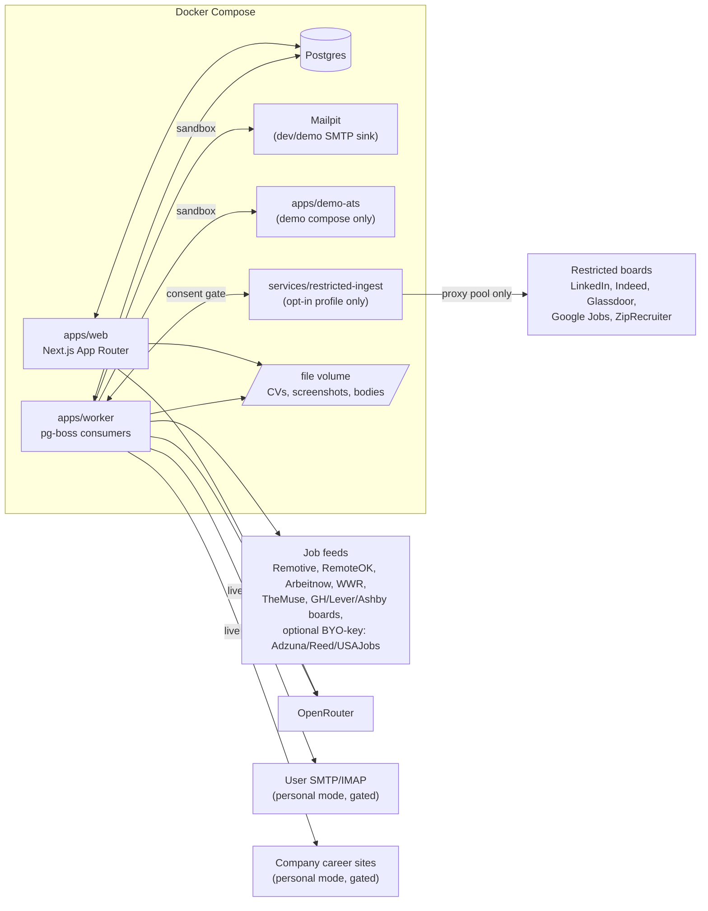

As of P6, the live parts of this diagram are `web`, `worker`, `postgres`, `mailpit`, `demo-ats`, the file volume, the keyless job **feeds** (Remotive, RemoteOK, Arbeitnow, WWR, The Muse, and watchlisted Greenhouse/Lever/Ashby boards), **user SMTP/IMAP** (gated by `SUBMISSIONS_LIVE_EMAIL` and, for a sandbox workspace, `SANDBOX_SMTP_ALLOWED_HOST` — Mailpit stands in for it in dev/demo), **company career sites** (gated by `SUBMISSIONS_LIVE_COMPANY_SITE` and, for a sandbox workspace, `SANDBOX_SITE_ALLOWED_HOST` — the in-repo `demo-ats` stands in for it in dev/demo and CI), and, if `OPENROUTER_API_KEY` is set, **OpenRouter** from `web` (grounded materials/Q&A generation, reply classification's tie-break, screening-question drafting) and `worker` (re-rank, `classifyReply`) — the restricted connector remains architected for but not yet wired up. Company-site submission always runs through an isolated Playwright browser context, and `apps/worker/src/autoapply` is the only **code** that ever touches a live DOM (ADR-0007) — but as of P5 the **process** running it is `web`, not `worker`: the interactive prepare/preview/confirm flow calls that driver in-process through the `@careerhq/worker/autoapply` package export (`apps/web/src/lib/site-driver.ts`), which is why `infra/Dockerfile.web` shares the worker's Playwright base image rather than `node:22-alpine`. `worker` carries the same driver for a future background queue path; its `autoapply.capture`/`autoapply.submit` consumers are deliberately left unregistered in `apps/worker/src/main.ts` until the §11 gate runs inside the jobs themselves — and until the post-click `writeFile` retry hazard in `runSubmitJob` is closed, since a pg-boss retry there would be a second submission ([`docs/roadmap.md`](docs/roadmap.md#carried-beyond-p6)). On the hosted demo, the deployment diagram in [`docs/architecture.md`](docs/architecture.md#11-the-hosted-demo--the-same-images-one-overlay-one-edge) shows which of these arrows the demo overlay deletes: OpenRouter and both live gates are gone, and Mailpit and `demo-ats` are the only reachable destinations.

## Documentation

- [`career-hq-product-spec.md`](career-hq-product-spec.md) — the normative product specification (v0.4).
- [`docs/architecture.md`](docs/architecture.md) — system diagram, data model, monorepo layout, gated-submission sequence.
- [`docs/roadmap.md`](docs/roadmap.md) — phase-by-phase delivery plan, P1–P6 (done) through P7, plus the work carried out of P6 with the reason each item was deferred.
- [`SECURITY.md`](SECURITY.md) — what is protected and what is not, the deliberate exclusions, how to report a vulnerability, and the current known limitations stated plainly.
- [`docs/runbook-demo.md`](docs/runbook-demo.md) — operating the hosted demo: deploy, update, logs, forced reset, backup, restore, rollback, and the post-deploy safety audit.
- [`docs/adr/0001-postgres-and-pg-boss.md`](docs/adr/0001-postgres-and-pg-boss.md) — why Postgres + pg-boss over SQLite/Redis.
- [`docs/adr/0002-gated-mutation-protocol.md`](docs/adr/0002-gated-mutation-protocol.md) — the three-layer gated-mutation design (state machine shipped in P1, enforced for real by the email channel in P4 and the company-site channel in P5).
- [`docs/adr/0003-openrouter-sequential-fallback.md`](docs/adr/0003-openrouter-sequential-fallback.md) — the ported `chat-json` pattern and why fallback is sequential, not raced.
- [`docs/adr/0004-grounding-contract-and-sensitive-answers.md`](docs/adr/0004-grounding-contract-and-sensitive-answers.md) — the grounding contract (deterministic citation post-validation, `NEEDS_FACTS`) and the conservative, widen-only sensitive-question policy.
- [`docs/adr/0005-credential-encryption.md`](docs/adr/0005-credential-encryption.md) — app-level libsodium secretbox for stored mail credentials, ciphertext-only rows, and the honest scope of what the master key does and doesn't protect against.
- [`docs/adr/0006-scraping-and-tos-boundaries.md`](docs/adr/0006-scraping-and-tos-boundaries.md) — the keyless-only core boundary and the isolated, opt-in restricted-source connector.
- [`docs/adr/0007-canonical-form-schema.md`](docs/adr/0007-canonical-form-schema.md) — DOM selectors are never the data model; the serializable `RawFormPage` boundary, fixture-testable adapters, and the hash tripwire that catches parser drift.

## Screenshots

Captured by a Playwright script against the local demo stack at 1440×900 with the demo seed, so the gallery can be regenerated whenever the UI changes: `pnpm demo:media`.

| | |
|---|---|
| [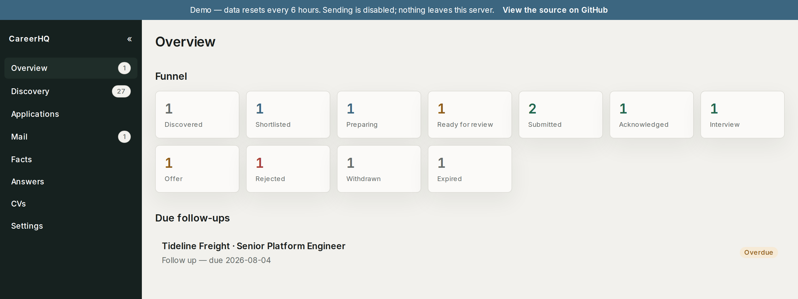](docs/media/01-overview.png) | **`/overview`** — the funnel across every state, the one computed next action, and follow-ups that are overdue. |
| [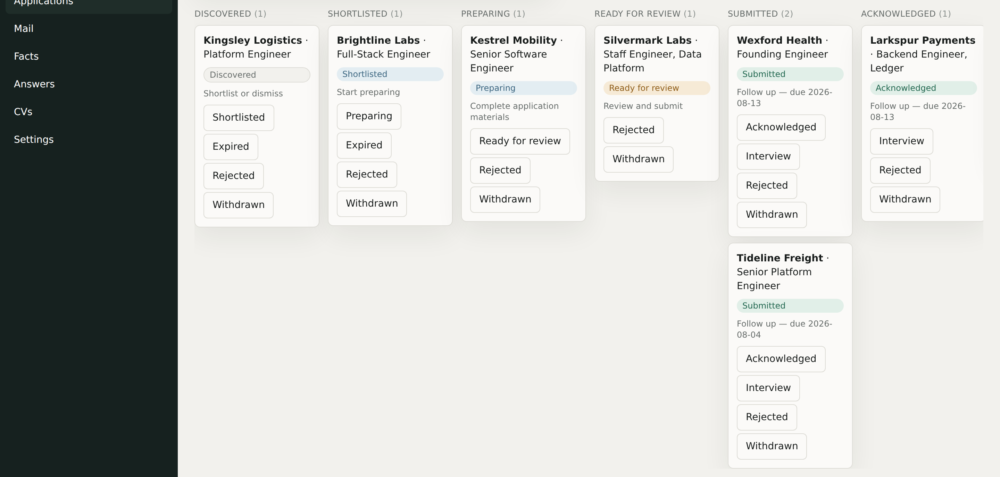](docs/media/02-applications-board.png) | **`/applications`** — the Kanban tracker; an illegal move shows the guard's own reason rather than silently failing. |
| [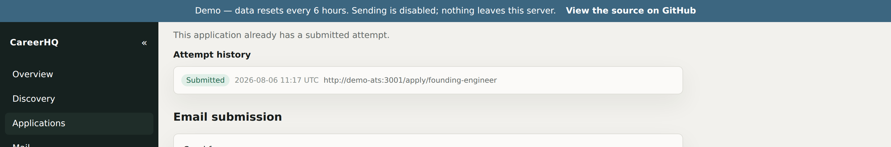](docs/media/03-application-timeline.png) | **An application's timeline** — append-only events with the trigger that caused each transition, not a mutable status field. |
| [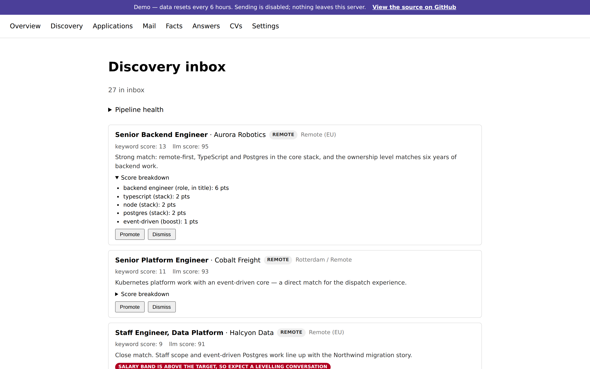](docs/media/04-discovery-inbox.png) | **`/jobs`** — the scored discovery inbox with a keyword score breakdown expanded, so the ranking is inspectable rather than a number. |
| [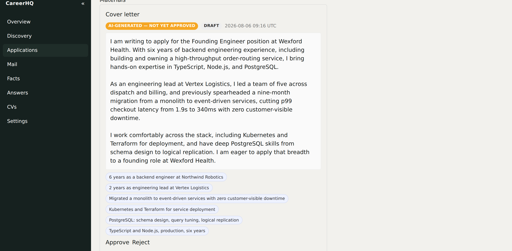](docs/media/05-materials-provenance.png) | **Materials panel** — an AI draft with provenance chips resolving each cited fact id back to its claim, and the "not yet approved" badge. |
| [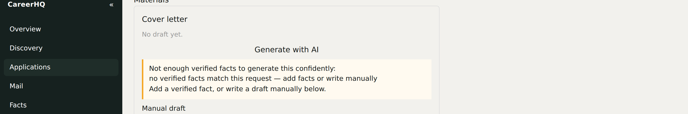](docs/media/06-needs-facts.png) | **`NEEDS_FACTS`** — generation refused because nothing in the fact bank grounds the claim. Nothing is persisted; the reasons are shown. |
| [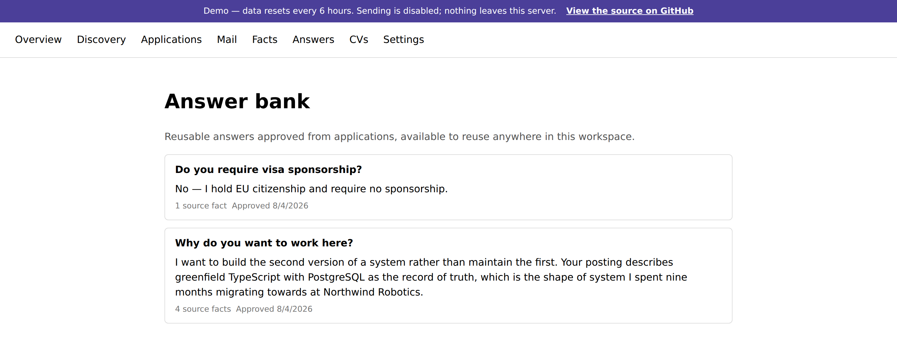](docs/media/07-answer-bank.png) | **`/answers`** — approved, reusable answers with their source-fact count, approval date, and a `STALE` flag past the review date. |
| [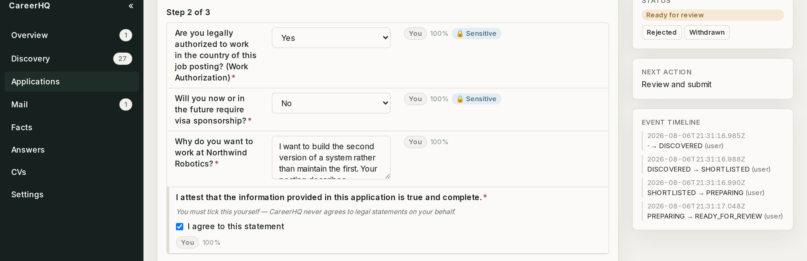](docs/media/08-autoapply-review.png) | **Auto-apply review** — every planned answer with its source and confidence, the never-pre-ticked consent checkbox, and a sensitive-field lock badge. |
| [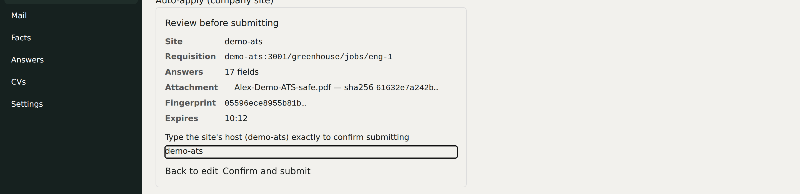](docs/media/09-preview-confirm.png) | **Preview → retype-target confirm** — the full payload, then the exact target typed back by hand before a single-use token is spent. |
| [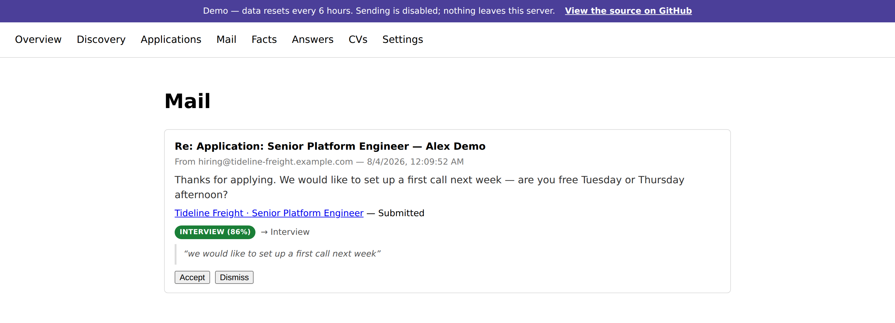](docs/media/10-inbox-suggestion.png) | **`/inbox`** — an inbound reply with its suggested classification, confidence and quoted evidence, waiting for a human accept or reject. |

**Walkthrough recording** — discovery → promote → grounded cover letter → auto-apply review → consent tick → preview → confirm → receipt: [`docs/media/walkthrough.mp4`](docs/media/walkthrough.mp4) (the capture script keeps the source [`walkthrough.webm`](docs/media/walkthrough.webm) when `ffmpeg` is not on `PATH`).

## License

MIT — see [`LICENSE`](LICENSE). Copyright (c) 2026 Nick Kalas.
