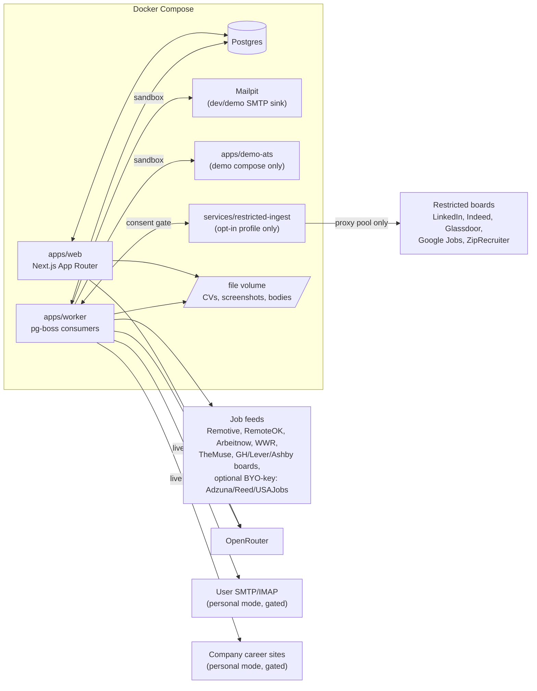

# Career HQ

An AI-assisted, self-hosted job-search workflow platform. It helps a single owner discover suitable roles, prepare grounded application materials from a personal fact bank, submit them through supported channels under an explicit multi-layer safety protocol, and track outcomes on a Kanban-style tracker with a full event history.

This is a portfolio project built to demonstrate full-stack product engineering end to end: a typed monorepo with enforced architectural boundaries, a Postgres-backed domain model with real state machines and database-level invariants, a deliberately conservative design for anything that mutates the outside world, and a CI pipeline that keeps all of it honest on every push. It is not a SaaS — it is a single-tenant app you run yourself, seeded with a fictional persona ("Alex Demo") so the tracker, fact bank, and event log are populated the moment it boots.

## Current status

**P1 — Foundation, tracker, and Fact Bank — is complete.** Shipped so far:

- Monorepo scaffold (pnpm workspaces + Turborepo), strict TypeScript, ESLint.
- Compose stack (`postgres`, `mailpit`, `web`, `worker`) with a parameterized Postgres host port.
- `packages/contracts` (shared Zod schemas/enums), `packages/core` (pure application + attempt state machines with guards), `packages/config` (validated env, submission gates default **off**), `packages/db` (Drizzle schema, migrations, repositories).
- Tracker UI: Kanban board with guarded state transitions (illegal moves show the guard's reason in the UI), application detail page with a genuine append-only event timeline, and an overview panel that surfaces the one computed next action and any overdue follow-ups.
- Candidate Fact Bank: CRUD across categories with sensitivity levels, verification/review dates, and stale-fact flagging.
- CV variant upload (designed + ATS-safe formats) with SHA-256 hashes on the file volume.
- Idempotent "Alex Demo" seed (`pnpm seed`) — ~15 facts, 2 CV variants, ~10 applications spread across states with real event history.
- CI (GitHub Actions): lint, typecheck, dependency-cruiser import-boundary checks, and the test suite against a real Postgres service container.

Everything past this point — job discovery ingestion, AI-assisted material generation, the live email channel, assisted auto-apply, the hosted demo, and the restricted-source connector — is **planned**, not built. See [`docs/roadmap.md`](docs/roadmap.md) for the full phase-by-phase plan (P2–P7) and [`career-hq-product-spec.md`](career-hq-product-spec.md) for the normative product spec.

## Quickstart

Standard path, from a clean clone and a fresh Postgres volume:

```bash
git clone <repo-url> && cd careerHQ-app
docker compose -f infra/docker-compose.yml up -d postgres mailpit
cp .env.example .env
pnpm install
pnpm --filter @careerhq/db db:migrate
pnpm seed
pnpm --filter @careerhq/web dev   # http://localhost:3000
```

Mailpit's web UI is at `http://localhost:8025` (dev/demo SMTP sink — nothing is wired to send through it yet in P1).

**Port already in use?** If `5432` is taken on your host, set `CAREERHQ_PG_PORT` (e.g. `CAREERHQ_PG_PORT=5433`) before `docker compose up`, and update `DATABASE_URL` in `.env` to match. The compose file reads this variable to remap the Postgres host port; the container's internal port and `web`/`worker`'s in-network `DATABASE_URL` are unaffected.

**Resetting the database.** `drizzle-kit migrate` does not drop existing objects. To fully reset (e.g. after a schema change that doesn't cleanly migrate), connect with `psql` and run:

```sql
drop schema public cascade;
drop schema if exists drizzle cascade;
create schema public;
```

then re-run `db:migrate` and `pnpm seed`. The second `drop schema` is necessary because `drizzle-kit` tracks applied migrations in its own `drizzle` schema, not just `public` — dropping only `public` leaves migration history that no longer matches reality.

## Architecture

Full detail, including the data model ERD, the gated-submission sequence diagram, and the monorepo layout, lives in [`docs/architecture.md`](docs/architecture.md). System overview (§1):



In P1, the live parts of this diagram are `web`, `worker`, `postgres`, `mailpit`, and the file volume — everything else (feeds, OpenRouter, live SMTP/IMAP, live company-site submission, the restricted connector) is architected for but not yet wired up.

## Documentation

- [`career-hq-product-spec.md`](career-hq-product-spec.md) — the normative product specification (v0.3).
- [`docs/architecture.md`](docs/architecture.md) — system diagram, data model, monorepo layout, gated-submission sequence.
- [`docs/roadmap.md`](docs/roadmap.md) — phase-by-phase delivery plan, P1 (done) through P7.
- [`docs/adr/0001-postgres-and-pg-boss.md`](docs/adr/0001-postgres-and-pg-boss.md) — why Postgres + pg-boss over SQLite/Redis.
- [`docs/adr/0002-gated-mutation-protocol.md`](docs/adr/0002-gated-mutation-protocol.md) — the three-layer gated-mutation design (state machine shipped in P1, enforcement lands in P4).

## Screenshots

Screenshots and a short demo video land with the P6 hosted-demo polish phase, once there is a public instance to record against.

## License

MIT. The `LICENSE` file itself is added at public release (P6), alongside the rest of the docs/portfolio polish — see [`docs/roadmap.md`](docs/roadmap.md#p6--hosted-demo-and-portfolio-polish).
