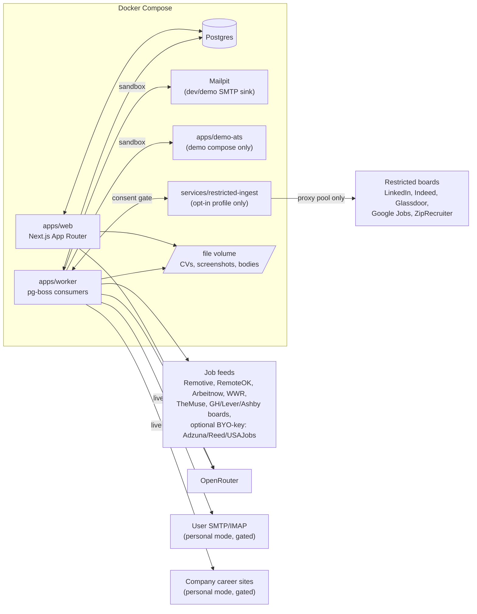
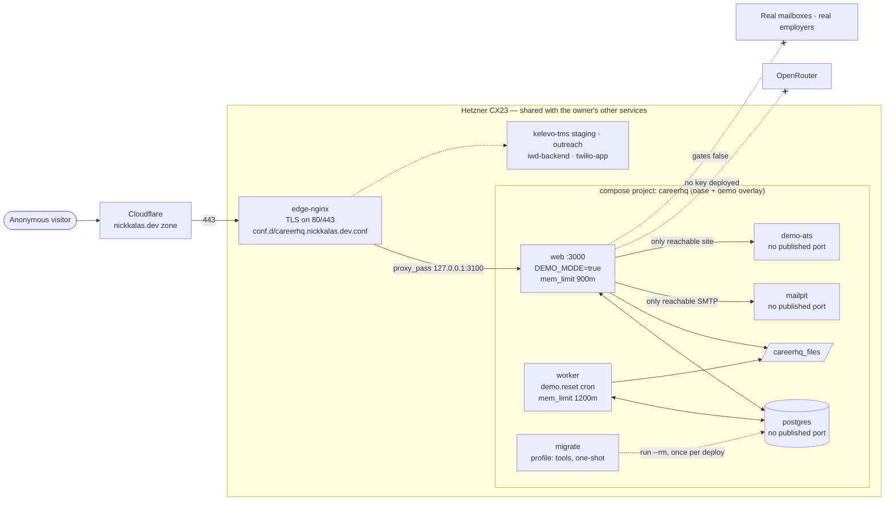
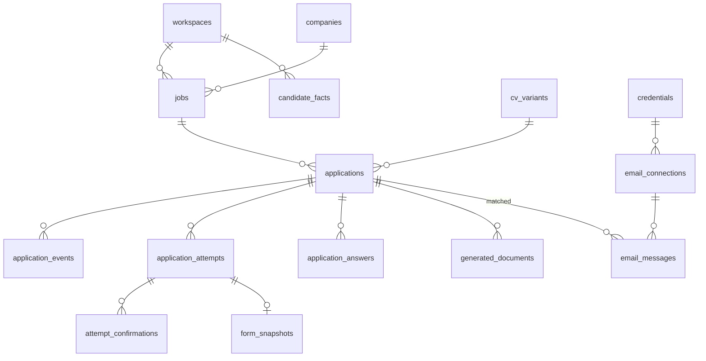
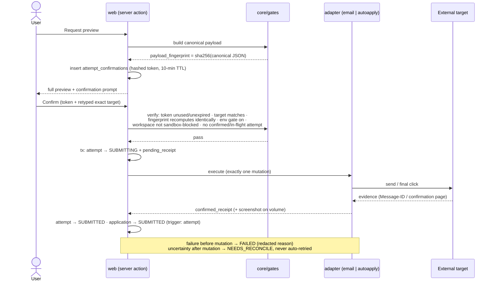

# Career HQ — Architecture

Companion to [`career-hq-product-spec.md`](../career-hq-product-spec.md) (v0.4). The spec says *what*; this document says *how and where*.

## 1. System overview



- `apps/web` — UI, server actions, route handlers. Enqueues work; never performs external mutations itself except LLM calls for interactive generation.
- `apps/worker` — long-lived Node process consuming pg-boss queues: `ingest`, `rerank`, `imap-sync`, `classify`, `autoapply`, `demo-reset`. Runs Playwright (image based on `mcr.microsoft.com/playwright`).
- `apps/demo-ats` — small Hono server with a fictional company careers page: a Greenhouse-style multi-step form (`eng-1`, carrying a required legal-attestation checkbox — the permanent-blocker demo) and a Lever-style single-page form (`eng-2`, the happy path). Serves two purposes: Playwright e2e target in CI (`apps/web/src/lib/site-e2e.test.ts`), and the only allowed auto-apply destination for local demos and the hosted demo.
- `packages/autoapply` — the browser-free "brain" of auto-apply: ATS detection, blocker detection, and the generic/Greenhouse/Lever parsers, all pure functions over a serializable `RawFormPage` (ADR-0007). **The browser boundary is narrow and explicit**: only `apps/worker/src/autoapply/extract.ts`'s in-page extractor ever touches a live DOM (inside an isolated Playwright context, `driver.ts`), by evaluating a script derived from its own function source (`fn.toString()`) so the browser and a linkedom-backed test run byte-identical extraction logic — everything past that boundary, including `apps/web`'s review screen and submission orchestrator, only ever sees plain, JSON-serializable data.
- `services/restricted-ingest` — optional Python service wrapping JobSpy for restricted-board discovery (LinkedIn, Indeed, Glassdoor, Google Jobs, ZipRecruiter). Own container under a dedicated Compose profile, absent from the default stack and the demo. Narrow JSON contract (bounded search matrix in, normalized listings out); mandatory user-supplied proxy pool, per-board circuit breakers, bounded runs. The worker calls it only when the spec §5.3 consent gate is fully satisfied (profile deployed + env flag + recorded in-app consent). Discovery only — no credentials, no applying.
- Postgres is the single store for structured data; large artifacts live on the file volume with hashes in the DB. pg-boss uses the same Postgres — no Redis, keeping the default stack at four services.

### 1.1 The hosted demo — the same images, one overlay, one edge

The public demo at `https://careerhq.nickkalas.dev` is not a fork or a second build. It is the *same* compose stack with `infra/docker-compose.demo.yml` layered on top, on a VPS the owner already uses for other services. What the overlay changes is which arrows in the diagram above still exist.



- **`web` is the only published port, and only on `127.0.0.1:3100`.** Postgres, Mailpit and `demo-ats` lose their published ports entirely (`ports: !reset []`), so they exist only as service names on the compose network. Mailpit's UI would otherwise be an open, unauthenticated mail viewer on a public IP.
- **The dashed crossed arrows are the point.** `OPENROUTER_API_KEY` is *deleted* by the overlay rather than blanked, and `AI_MODE=replay` serves committed fixtures, so the demo cannot spend tokens or depend on a provider. Both live-submission gates are pinned `false` **as literals**, not interpolations — no env file, shell variable or `docker compose` invocation can open them.
- **`migrate` is a profiled one-shot** (`--profile tools run --rm migrate`), the worker image with `db:migrate` as its command. Nothing else in the repo migrates the demo schema: the worker does not migrate at boot, and the box carries no Node toolchain. Its `restart: "no"` is deliberate — `unless-stopped` restarts a container that exited 0 as readily as one that crashed, and this one is *supposed* to exit 0.
- **Hard `mem_limit` on every service**, because the demo is a guest on a 3.7 GB box: 900 + 1200 + 400 + 128 + 128 = 2756 MB worst case. Log rotation is capped for the same reason in the other dimension. A runaway Chromium is OOM-killed inside its own container instead of pushing a neighbour into swap.
- **The edge is not ours.** `edge-nginx` already terminates TLS for the owner's other sites; CareerHQ contributes one vhost file (`infra/edge/careerhq.nickkalas.dev.conf`, committed here) that gets copied into the box's `conf.d`. `nginx -t` must pass before any reload — a broken reload takes the neighbours down too.

Operational procedures — deploy, update, forced reset, backup, restore, rollback — are in [`runbook-demo.md`](runbook-demo.md).

## 2. Monorepo layout

pnpm workspaces + Turborepo. Import boundaries enforced by dependency-cruiser in CI.

```
careerHQ-app/
├── apps/
│   ├── web/                      # Next.js 15; src/app/(dashboard)/{jobs,applications,facts,email,settings}
│   ├── worker/                   # src/jobs/{ingest,rerank,imap-sync,classify,autoapply,demo-reset}.ts
│   └── demo-ats/
├── packages/
│   ├── contracts/                # Zod schemas + shared types; zero runtime deps
│   ├── core/                     # pure domain logic — no IO, no db imports
│   │   └── src/{state,scoring,gates,grounding,fingerprint}/
│   ├── db/                       # Drizzle schema, migrations, repositories, seed
│   ├── ai/                       # OpenRouter client, fallback, tasks, replay fixtures
│   ├── ingest/                   # fetchers + normalizer + dedupe
│   ├── email/                    # SMTP send (nodemailer), IMAP sync (imapflow), threading
│   ├── autoapply/                # canonical form schema, ATS adapters, Playwright driver
│   └── config/                   # zod-parsed env, safety-gate resolution, model tiers
├── infra/
│   ├── docker-compose.yml        # web, worker, postgres, mailpit, demo-ats
│   ├── docker-compose.demo.yml   # demo env as literals, mem caps, one-shot migrate
│   ├── demo.env.example          # the operator's env file — mostly a list of what is NOT in it
│   ├── edge/                     # the committed vhost for careerhq.nickkalas.dev
│   └── Dockerfile.{web,worker,demo-ats}
├── services/
│   └── restricted-ingest/        # optional JobSpy connector; own profile, never in demo
├── docs/{adr,architecture.md,roadmap.md,runbook-demo.md,media/}
├── SECURITY.md                   # what is protected, what is not, and what is excluded on purpose
├── LICENSE                       # MIT
└── .github/workflows/ci.yml
```

**Dependency rules:** `contracts` ← everything. `core` depends only on `contracts`. `ai` / `email` / `autoapply` / `ingest` depend on `contracts` + `core`. Only `web` and `worker` compose everything (and are the only importers of `db` repositories alongside the feature packages' service layers). `core` receives plain objects — it never touches the database. `apps/web` drives its own interactive auto-apply session (and its e2e suite) by opening a Playwright session directly, in-process — but it reaches the driver code itself only through `apps/worker`'s own package `exports` map (`@careerhq/worker/autoapply`), never a relative import across the app boundary; a dependency-cruiser rule (`no-relative-cross-app-web-to-worker`/`-worker-to-web`) enforces this both directions.

## 3. Data model

All domain tables carry `workspace_id`. Naming: snake_case tables, Drizzle schema in `packages/db/src/schema/`.



Key tables (columns abbreviated; see spec §12 for entity semantics):

| Table | Notable columns / constraints |
|---|---|
| `workspaces` | `kind: personal\|sandbox` |
| `companies` | `name, domain, ats_hint` |
| `jobs` | `source, external_id, url, title, remote_mode, description_md, content_hash, first/last_seen_at, expired_at, keyword_score, keyword_breakdown jsonb, llm_score, llm_rationale, status inbox\|promoted\|dismissed`; **unique** `(workspace_id, source, external_id)` |
| `ingest_runs` | `source, started/finished_at, fetched, new, errors jsonb` |
| `applications` | `job_id, state, channel, cv_variant_id, next_action, next_action_due` |
| `application_events` | append-only: `from_state, to_state, trigger user\|attempt\|classification\|system, actor, payload jsonb` |
| `application_attempts` | `channel email\|company_site\|external, status, target_fingerprint, payload_fingerprint, pending_receipt jsonb, confirmed_receipt jsonb, failure_reason`; **partial unique** `(application_id) WHERE status='submitted'` |
| `attempt_confirmations` | `token_hash, payload_fingerprint, expires_at, consumed_at` |
| `candidate_facts` | `category, claim, detail, evidence_url, sensitivity, verified_at, review_by, archived_at` |
| `application_answers` | `question_norm, answer, origin deterministic\|ai\|user, source_fact_ids uuid[], confidence, sensitivity, approval, reusable, canonical_field` |
| `generated_documents` | `kind cover_letter\|email_body, content_md, source_fact_ids uuid[], model, approval` |
| `cv_variants` | `label, format designed\|ats, file_path, sha256` |
| `credentials` | `kind, ciphertext bytea` (libsodium secretbox, key from `CAREERHQ_MASTER_KEY`) |
| `email_connections` | `label, from_address, smtp jsonb, imap jsonb, credential_id, health` |
| `email_messages` | `direction, message_id, in_reply_to, references_ids[], subject, snippet, body_ref, application_id, match_method headers\|sender\|semantic\|manual, classification, classification_confidence, suggested_transition, suggestion_state` |
| `form_snapshots` | `attempt_id, ats_type greenhouse\|lever\|generic, parser_version, canonical_fields jsonb, form_fingerprint, current_step, recovery_state jsonb` |

### State machines (`packages/core/src/state/`)

Pure transition maps with guards; every transition appends an `application_events` row and the `state` column is a projection. Legal transitions per spec §6.2.

Attempt lifecycle:

```
DRAFT → READY → PENDING_CONFIRMATION → SUBMITTING → SUBMITTED
                                          ├→ FAILED           (error before mutation)
                                          ├→ BLOCKED          (gate/sandbox refusal)
                                          └→ NEEDS_RECONCILE  (uncertain after mutation; human-only resolution)
```

`SUBMITTING` + `pending_receipt` are written transactionally **before** the external mutation, so a crash mid-send leaves an attempt that is visibly unresolved rather than silently lost.

## 4. Gated submission — sequence



The three layers (env gates, sandbox adapter block, confirmation binding) are independent; disabling one never weakens the others. The UI only displays gate state.

## 5. AI layer (`packages/ai`)

```
packages/ai/src/
├── client/
│   ├── chat-json.ts      # OpenAI-compatible JSON-mode call: tolerant extraction,
│   │                     #   Zod validation, isUseful predicate, never-throws result
│   ├── fallback.ts       # sequential ordered-model fallback; backoff on 429/5xx;
│   │                     #   per-model cooldown after rate limit
│   └── stream.ts         # SSE streaming for long-form generation
├── tasks/                # one module per task: prompt builder + Zod schema + isUseful + tier
│   ├── rerank.ts
│   ├── generate.ts
│   ├── classify-reply.ts
│   └── interpret-field.ts
├── replay/               # record/replay: (task, promptHash) → fixture; CI + demo mode
└── fixtures/
```

Design notes:

- `chat-json.ts` ports the proven pattern from kelevoTMS (`apps/backend/src/features/ai/llm/chat-json.service.ts`): JSON mode + `temperature: 0`, tolerant extraction for cheap models that wrap JSON in prose, schema validation, `isUseful` so a valid-but-empty result counts as failure, and a discriminated result object instead of exceptions.
- Deliberately **not** ported: kelevoTMS's parallel two-lane race router. Racing burns ~2× tokens to cut latency — the wrong trade against rate-limited free tiers. Sequential fallback with cooldown is the correct policy here (ADR-0003).
- Model tiers are configuration data (env/db), not code — free-model availability churns monthly. Two tiers: `fast` (rerank, classify, interpret, sensitivity tie-break) and `writing` (cover letters, narrative answers; optionally a cheap paid model as the last fallback entry).
- Grounding post-validation lives in `packages/core/src/grounding/`, not in `ai` — deterministic code decides whether a generation is acceptable (spec §7.2).

## 6. Workspaces, demo mode, and safety wiring

- Session middleware resolves the active workspace; the demo deployment pins it to the sandbox workspace and disables login.
- `docker-compose.demo.yml` sets `SANDBOX_FORCE_SAFE=true`, points SMTP at Mailpit, sets the auto-apply origin allowlist to the `demo-ats` service, runs `ai` in replay mode, and schedules `demo-reset` (truncate sandbox workspace + reseed) every 6 hours.
- `demo-reset` is registered only when `DEMO_MODE=true`, and the worker `unschedule`s it when demo mode is off — a schedule row outlives the process that created it, so a one-off demo run must not leave the job firing forever. The worker also runs one reset at boot: pg-boss does not fire a schedule on registration, so without it a freshly deployed demo box is empty until the next cron boundary.
- The reset is a single transaction holding `pg_advisory_xact_lock(DEMO_SEED_LOCK_KEY)`. The demo workspace is a database-global singleton (`kind = 'sandbox' AND name = 'CareerHQ Demo'`) that `getActiveWorkspace` **bootstraps when missing**, so an un-transactional delete-then-rebuild let a single visitor request create a rival demo workspace, and two overlapping resets deleted rows each other was mid-write on.
- The sandbox block is evaluated inside `evaluateSubmissionGates` (`packages/core/src/gates`), the single gate matrix both `apps/web/src/lib/email-submission.ts` and `apps/web/src/lib/site-submission.ts` call before their one mutation — a UI or route-handler bug cannot bypass it.
- Demo mutations are rate-limited; credential setup is disabled for sandbox workspaces — server-side, in the action, not by hiding the form.
- Backup is two artifacts, not one: `pg_dump` of the database *and* a tar of the `careerhq_files` volume the database's paths point into. A dump alone restores an app whose CVs and screenshots 404. Commands: [`runbook-demo.md`](runbook-demo.md) §5–6.

## 7. Security

- Credentials: libsodium secretbox with `CAREERHQ_MASTER_KEY` (env). Ciphertext-only in Postgres; plaintext never serialized to the client, logged, or included in errors. Threat model and the "why not an OS keyring" rationale: ADR-0005.
- Redaction middleware on logs and error responses (secrets, auth headers, message bodies).
- All mutations are POST server actions (same-origin); confirm endpoint rate-limited; tokens stored hashed.
- Personal deployments sit behind an owner login and reverse-proxy TLS; the demo exposes only the sandbox workspace.
- The full statement of what is protected, what is explicitly *not*, which capabilities are excluded on purpose (no CAPTCHA solving, no restricted-board automation, no unattended applying), and the current known limitations is [`SECURITY.md`](../SECURITY.md). It is kept honest rather than reassuring: one claim in it was falsified by a redirect bypass during P6 and was corrected in place rather than softened.

## 8. Testing and CI

| Layer | Tooling | Focus |
|---|---|---|
| Unit | Vitest | transition/guard tables, scoring breakdown, fingerprint tamper detection, gate matrix (sandbox × env × token × duplicate), JSON extraction + fallback (mocked 429 sequences), grounding validation, form normalization from saved ATS HTML, threading |
| Integration | Vitest + testcontainers | Drizzle repositories, Mailpit SMTP |
| E2E | Vitest + a real Chromium session (Playwright driver) | Mailpit round-trip send (`email-e2e.test.ts`); full auto-apply round trip vs `demo-ats` plus all five gate refusals and both blocker kinds, 7 cases (`site-e2e.test.ts`) — every suite skips cleanly, not falsely-green, when its dependency (`TEST_DATABASE_URL`, Mailpit, `demo-ats`, Chromium) is unavailable |
| CI | GitHub Actions | PR: lint, typecheck, dependency-cruiser, unit + integration, migration drift. main: + e2e (compose), image builds |

## 9. ADR index

| ADR | Decision |
|---|---|
| 0001 | Postgres + pg-boss over SQLite/Redis |
| 0002 | Gated-mutation protocol (web translation of the receipt/fingerprint design) |
| 0003 | OpenRouter sequential fallback; why not a parallel race router |
| 0004 | Grounding contract and sensitive-answer policy |
| 0005 | App-level credential encryption vs OS keyring |
| 0006 | Scraping/ToS boundaries; restricted-source connector isolation and consent lane |
| 0007 | Canonical form schema — selectors are not the data model |
